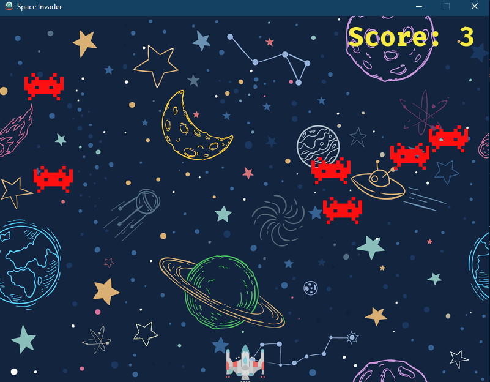

# Space Invader Game<br>

## Introduction
Classic space invader 2D game.<br>
Recall your old childhood memories, by playing the classic space invader game.


## Functions
1) Left cursor to move spaceship left.
2) Right cursor key to move spaceship right.
3) Space bar to fire a bullet.


## Output:

<br>

## Prerequisites:
1) Python interpreter.
2) Keyboard (to play)

## Environment setup
1) Clone repo to your machine.
   ```sh
   git clone https://github.com/Aka-sh11/Space_Invader_Game
   ```
   
 2) Run the main.py file.
 

## If you like this, please appreciate by giving star :star: and Fork 🍴 this repo.

Thank You...! :pray: :pray: :pray:
